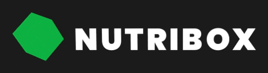
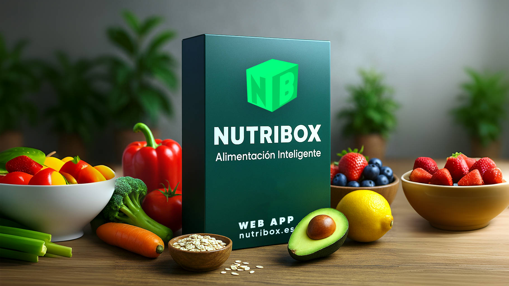
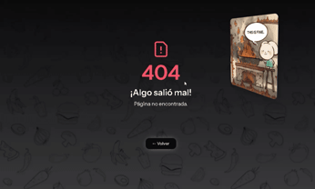
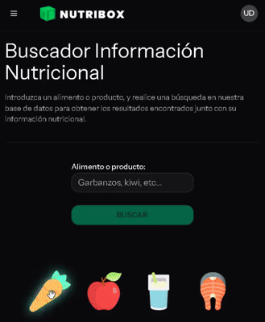
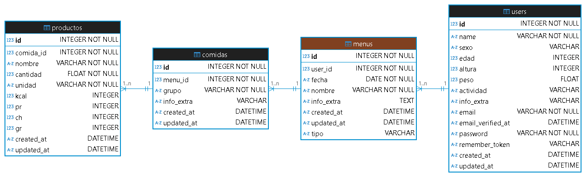
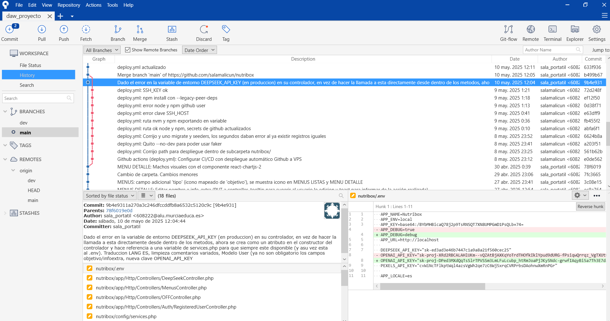
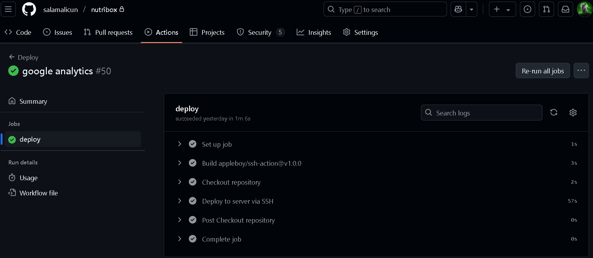
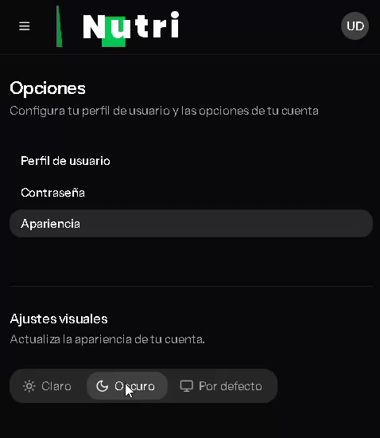
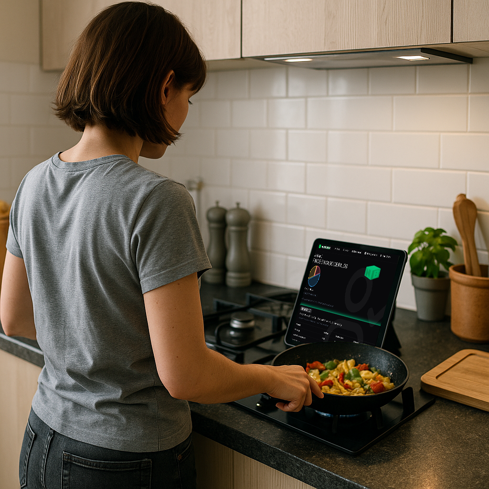
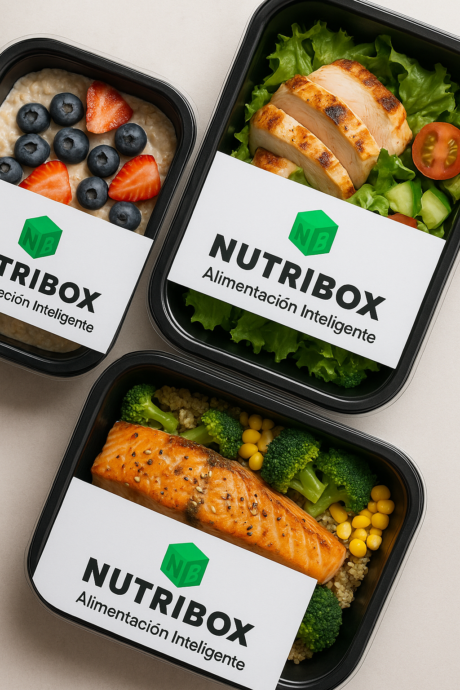

# [Nutribox.es](https://nutribox.es)

**Alimentación Inteligente**

Nutribox es una aplicación web Single Page Application (SPA) orientada a la consulta, análisis de la compatibilidad entre alimentos y patologías, creación y gestión de menús diarios, recomendaciones personalizadas mediante IA y recursos multimedia. Integra tecnologías modernas tanto en backend (Laravel 12 o Inertia.js) como en frontend (React 19 con Typescript), APIs externas (Deepseek, Open Food Facts y Pexels), un diseño responsive con versiones Desktop/Móvil, diferentes apariencias visuales, renderizado en cliente (CSR) y despliegue automatizado CI/CD.
<p>&nbsp;</p>

## Tabla de contenidos
- [Nutribox.es](#nutriboxes)
  - [Tabla de contenidos](#tabla-de-contenidos)
  - [Demo y capturas](#demo-y-capturas)
  - [Características principales](#características-principales)
  - [Stack tecnológico](#stack-tecnológico)
    - [Backend](#backend)
    - [Frontend](#frontend)
    - [Persistencia](#persistencia)
    - [Utilidades](#utilidades)
    - [Control de versiones](#control-de-versiones)
    - [Despliegue a producción](#despliegue-a-producción)
  - [Estructura básica de carpetas](#estructura-básica-de-carpetas)
  - [Instalación y puesta en marcha](#instalación-y-puesta-en-marcha)
  - [Rutas y páginas principales](#rutas-y-páginas-principales)
    - [`routes/web.php` y `resources/js/pages/`](#routeswebphp-y-resourcesjspages)
    - [Componentes destacados `resources/js/components/`](#componentes-destacados-resourcesjscomponents)
  - [Librerías destacadas](#librerías-destacadas)
  - [Gestión de dependencias y scripts](#gestión-de-dependencias-y-scripts)
    - [Scripts Framework (`Laravel 12`)](#scripts-framework-laravel-12)
    - [Scripts principales (`package.json`)](#scripts-principales-packagejson)
    - [Scripts backend (`composer.json`)](#scripts-backend-composerjson)
    - [Dependencias clave (extracto)](#dependencias-clave-extracto)
  - [Variables de entorno](#variables-de-entorno)
  - [Buenas prácticas, accesibilidad y detalles técnicos](#buenas-prácticas-accesibilidad-y-detalles-técnicos)
  - [Licencia y créditos](#licencia-y-créditos)
<p>&nbsp;</p>

## Demo y capturas


| Desktop | Mobile |
|:-------:|:------:|
|  |  |
<p>&nbsp;</p>

## Características principales
- **Búsqueda avanzada de alimentos** en la base de datos Open Food Facts (OFF).
- **Evaluador IA**: Relaciona alimentos con patologías mediante Inteligencia Artificial (DeepSeek).
- **Diseño de menús diarios personalizados** (con previsualización y almacenamiento).
- **Gestión de menús guardados**: Consulta, edición, borrado y visualización detallada.
- **Sección multimedia**: Streaming de Canal Cocina e integración con Youtube.
- **Dashboard y configuración de usuario**
- **Auto deploy CI/CD**: Mediante Github Actions
- **Backups automático de la Base de Datos**: Mediante comando Artisan personalizado + 'crontab' en Servidor.
- **Manejo de todo el tráfico en Apache a URL segura**: Configuración SSL en ficheros .conf + certbot (Let's Encrypt).
- **SPA completa con navegación instantánea** gracias a la suma de React + Inertia.js
- **Manejo de errores**: Página TS que recoge errores 403, 404, 500, etc.. y personaliza el mensaje.
- **Accesibilidad y responsive**: UI moderna, adaptable a pantallas pequeñas y con modo oscuro.
- **Animaciones gráficas vectoriales**: Adobe After Effects + .json + Lottie 
- **Imágenes animadas mediante IA** y tips nutricionales en las esperas de respuesta de las APIs.
- **Sistema de autenticación mediante tokens y protección de rutas con Middleware**.
- **Panel de información de la App y estado del Servidor** (`/info` + `/estado`).


<p>&nbsp;</p>
<p>&nbsp;</p>

## Stack tecnológico
### Backend
- **Laravel Framework 12+ PHP 8.2+**: Eloquent ORM, alta/reset contraseña con token, autenticación, colas, seeders, migraciones, etc..
- **Inertia.js**: Conexión directa con el frontend React sin API REST convencional.
- **Vite 6**: Para creación de bundles
- **API Deepsek con wrapper/deepseek-php-client**: Para evaluación nutricional y creación de menús mediante IA.
- **API Open Food Facts v1**: Para búsqueda de alimentos y productos en su base de datos.
- **API Pexels v1**: Para decoración background resultados evaluador nutricional.
- **Lubusin Decomposer y Stethoscope**: Diagnóstico del entorno Laravel y del Servidor.
- **Handler de excepciones en bootstrap/app.tsx** Enrutamiento personalizado según el problema a `Error.tsx`


<p>&nbsp;</p>

### Frontend
- **React 19**: SPA moderna, componentes funcionales, hooks.
- **TypeScript 5+**: Tipado estricto.
- **Tailwind CSS 4**: CSS-first (Personalización directa en CSS), sistema de colores OKLCH, modo dark, versiones por tamaño de pantalla.
- **shadcn/ui, Reactbits, Radix UI, HeadlessUI**: Componentes de interfaz listos y accesibles.
- **Framer Motion, Embla Carousel**: Animaciones y carruseles interactivos.
- **Lottie y LottieFiles**: Integración de animaciones vectoriales en .json
- **Chart.js y React-Chartjs-2**: Visualización de datos.
- **Sonner**: Notificaciones y feedback.
- **Lucide React**: Iconografía moderna.
- **favicon.ico animado**

- **Streaming de vídeo embebido y playlist de YouTube**: Integración multimedia.
- **React FC AlimentoInteractivo**: Búsqueda interactiva. <br>


<p>&nbsp;</p>

### Persistencia
- **Base de datos**: SQLite
- **Tablas principales** (y sus relaciones): users, menus, comidas, productos
- **Gestión mediante DBeaver UI (sqlite3 CLI en Servidor)**
- **Backup diario**: Mediante el comando `php artisan bkp:database` en Laravel y crontab -e en el servidor <br>

<p>&nbsp;</p>

### Utilidades
- **Vite 6**: Bundler y dev-server ultrarrápido.
- **Prettier, ESLint**: Formato y linting.
- **Unit Tests**: (`php artisan test`)
- **Microsoft Playwright**: Testing end-to-end (`npx playwright test --ui`)
- **Google Analytics 4**: Incorporado a `app.blade.php` y a .env. Para obtención de datos de visitas, flujo e interacción de usuario.
<p>&nbsp;</p>

### Control de versiones
- **Repositorio remoto en Github**: Trabajo con 2 ramas, dev (Donde se ha desarrollado alguna feature mergeada más tarde en la rama principal) y main.
- **Git Story** <br>


- **Gestión de repositorios en desarrollo**: SourceTree <br>

<p>&nbsp;</p>

### Despliegue a producción
- **Auto deploy CI/CD** mediante Github Actions
- **deploy.yml** Despliegue automático mediante SSH (Repo remoto -> VPS, VPS -> Repo remoto), comandos GIT, instalación de dependencias, comandos de base de datos, caching y buildeo <br>

<p>&nbsp;</p>

## Estructura básica de carpetas
```
nutribox/
├── app/                # Lógica principal Laravel (modelos, controladores, etc..)
├── config/             # Configuración de servicios y app
├── database/           # Migraciones, seeders y factories
├── public/             # Recursos públicos (assets, imágenes, etc..)
├── resources/
│   ├── css/            # Estilos Tailwind y CSS personalizado
│   ├── js/
│   │   ├── components/ # Componentes React y UI propios/shadcn
│   │   ├── layouts/    # Layouts globales y específicos
│   │   ├── pages/      # Páginas principales SPA
│   │   ├── types/      # Tipos TypeScript compartidos
│   │   └── lib/        # Utilidades y helpers
├── routes/
│   ├── web.php         # Definición de rutas web principales y SPA
│   ├── auth.php        # Rutas de autenticación
│   └── settings.php    # Rutas de configuración
├── storage/            # Almacenamiento de archivos, logs
├── tests/              # Tests unitarios
├── .env                # Configuración de entorno
├── composer.json       # Dependencias PHP (Laravel)
├── package.json        # Dependencias JS/TS y scripts
└── vite.config.ts      # Configuración Vite

```
<p>&nbsp;</p>

---
## Instalación y puesta en marcha
1. **Clona el repositorio**

   ```sh
   git clone https://github.com/salamalicun/nutribox.git
   cd nutribox
   ```

2. **Instala dependencias**

   - Backend:
     ```sh
     composer install
     ```
   - Frontend:
     ```sh
     npm install

     # Con React 19 si alguna dependencia da error, usa:
     # npm install --legacy-peer-deps
     ```

3. **Configura las variables de entorno**

   - Copia `.env.example` a `.env` y ajusta las claves necesarias (Base de datos, APIs, emails...).

4. **Genera la clave de la app y configura la base de datos**

   ```sh
   php artisan key:generate
   php artisan migrate --seed
   ```

5. **Arranca el entorno de desarrollo**

   ```sh
   composer dev

   # O bien arranca individualmente back y front:
   php artisan serve
   npm run dev
   ```

6. **Build de producción**
   ```sh
   npm run build
   ```
<p>&nbsp;</p>

## Rutas y páginas principales
### `routes/web.php` y `resources/js/pages/`
- `/` → (`welcome.tsx`) Landing page (Acceso a `/login` y a `/register`)
- `/inicio` → Página principal con accesos rápidos y opciones
- `/offbuscar` → Formulario búsqueda alimentos OFF
- `/offresultados` → Resultados de búsqueda
- `/dsevaluar` → Formulario evaluar alimento y patología (IA)
- `/ds-evaluar-resultados` → Resultados evaluador
- `/menucrear` → Formulario crear menú personalizado
- `/controlleraprevisualizar` → Previsualizar menú generado antes de guardar
- `/menus/guardar` → Guardar menú en base de datos
- `/menuslistar` → Listar menús guardados
- `/menus/{menuSeleccionado}` → Ver menú en detalle
- `/menus/{id}` (DELETE) → Borrar menú
- `/menus/{id}` (PUT) → Editar nombre/información_extra menú
- `/multimedia` → Sección multimedia (Streaming vídeo y Youtube)
- `/info` → Panel info técnica (Laravel Decomposer)
- `/estado` → Panel estado servidor (Laravel Stethoscope)
- `Error.tsx` → Página de error dinámica que recoge props con el tipo de error + mensaje
- `drawerConCarousel.tsx` → 'Acerca de' en un componente Drawer


<p>&nbsp;</p>

### Componentes destacados `resources/js/components/`
- `app-sidebar.tsx` → Sidebar de navegación (Inicio, Búsqueda alimento, Evaluador IA, Creador Menús, Menús Guardados, Multimedia, Acerca de, Opciones)
- `ui/` → Colección de componentes shadcn/ui y de otras librerias (botones, inputs, selects, dialogs, carousels, etc..)
- `nav-*` → Navegación, usuario, footer
- `AlimentoInteractivo`, `GridMotion`, `FollowCursor`, toast de `sonner`, `DataTable`, etc..
<p>&nbsp;</p>

## Librerías destacadas
- **shadcn/ui**: Librería base del framework.
- **Radix UI**: Base para muchos componentes personalizados.
- **HeadlessUI**: Utilizada en transiciones.
- **Reactbits**: Gridmotion y FollowCursor.
- **Embla Carousel**: Carruseles de imágenes y sliders para los momentos de carga y para 'Acerca de'.
- **Framer Motion**: Base para varios componentes animados.
- **Lottie, LottieFiles**: Animaciones vectoriales desde After Effects.
- **Chart.js, React-Chartjs-2**: Gráficas y visualización de datos.
- **Sonner**: Para notificaciones toast.
- **Lucide React**: Iconos SVG.
- **React-Youtube**: Integración Youtube.
<p>&nbsp;</p>

## Gestión de dependencias y scripts
### Scripts Framework (`Laravel 12`)
- `php artisan serve` → Arranca backend
- `php artisan route:list` → Muestra las rutas disponibles
- `php artisan test` → Ejecuta los tests preconfigurados
- `php artisan bkp:database` → Backup de la base de datos (Configurado con crontab -e para hacerla a diario)

### Scripts principales (`package.json`)
- `npm run dev` → Arranca frontend en desarrollo (Vite)
- `npm run build` → Build de producción
- `npm run build:ssr` → Build SSR

### Scripts backend (`composer.json`)
- `composer dev` → Arranca Laravel, colas y Vite en paralelo
- `composer dev:ssr` → Arranca SSR + logs + workers

### Dependencias clave (extracto)
Ver el detalle completo en `package.json` y `composer.json`.  
Incluye:

- `@inertiajs/inertia`, `@inertiajs/react`, `@headlessui/react`, `@radix-ui/*`, `framer-motion`, `gsap`, `embla-carousel`, `lottie-react`, `tailwindcss`, `vite`, `typescript`, etc..
<p>&nbsp;</p>

## Variables de entorno
Principales variables:
- `APP_NAME`, `APP_ENV`, `APP_KEY`, `APP_URL`
- Integraciones externas: `DEEPSEEK_API_KEY`, `PEXELS_API_KEY`, `GA_MEASUREMENT_ID`
- Base de datos: `DB_CONNECTION`, `DB_DATABASE`, etc..
- Email: `MAIL_HOST=smtp.gmail.com`, `MAIL_FROM_ADDRESS=holanutribox@gmail.com`, etc..
- Otros servicios: `MONITORING_PANEL_KEY=admin`, `DEPLOYED_AT="YYYY-MM-DD HH:MM:SS"`, etc..
<p>&nbsp;</p>

## Buenas prácticas, accesibilidad y detalles técnicos
- **SPA real**: Toda la navegación y el estado de la app gestionados desde React + Inertia, la comunicación de Inertia con Inertia Runtime en el front, permite que se recargue solo lo que cambie.
- **SSR y SEO**: Con posibilidad de renderizado en servidor para mejorar velocidad y posicionamiento, se utiliza Google Analytics 4 para anañizar el tráfico de los usuarios (Localización, páginas visitas, tiempo en ellas, clicks, etc..).
- **Accesibilidad**: Todos los componentes clave cumplen normas ARIA y accesibilidad.
- **Modo claro/oscuro y colores OKLCH**: Varias apariencias y y estilos definidos en `resources\css\app.css`.
- **Animaciones ligeras Lottie**.
- **Proyecto Lottie Animations de Adobe After Effects incluido**
- **Código tipado, formateado y testeado**.
- **Migraciones y Seeders**: Base de datos fácil de regenerar y de sembrar.
- **Panel información App**: `/info` (Laravel Decomposer, inspección técnica de Framework y del servidor).
- **Panel estado servidor VPS**: `/estado?key=admin` (Laravel Stethoscope, estadísticas de los últimos 7 días sobre uso de cpu, ram, caidas del server, etc..).


<p>&nbsp;</p>

## Licencia y créditos
- **Licencia**: MIT 
- **Tutor**: [Jose Manuel Rubira Miranda](https://www.linkedin.com/in/ACoAAFO5FNQBZNg6AQZwBXpW4STrthV3ala8c7E?lipi=urn%3Ali%3Apage%3Ad_flagship3_leia_profile_views%3BjRoMe5mOTZ2gZxz%2F0Y%2BXLg%3D%3D)
- **Desarrollador**: Jose Antonio Martínez Pastor [LinkedIn](https://www.linkedin.com/in/jamartinezpastor/) | [Email](mailto:jamartinezpastor@gmail.com) | [Portfolio Web](https://martinezpastor.es/)


<p>&nbsp;</p>

>## [nutribox.es](https://nutribox.es)
`README.md versión 2.2.1 (20250626)`