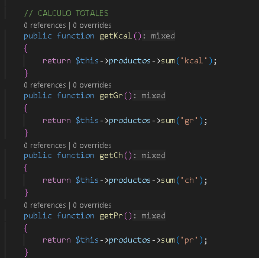
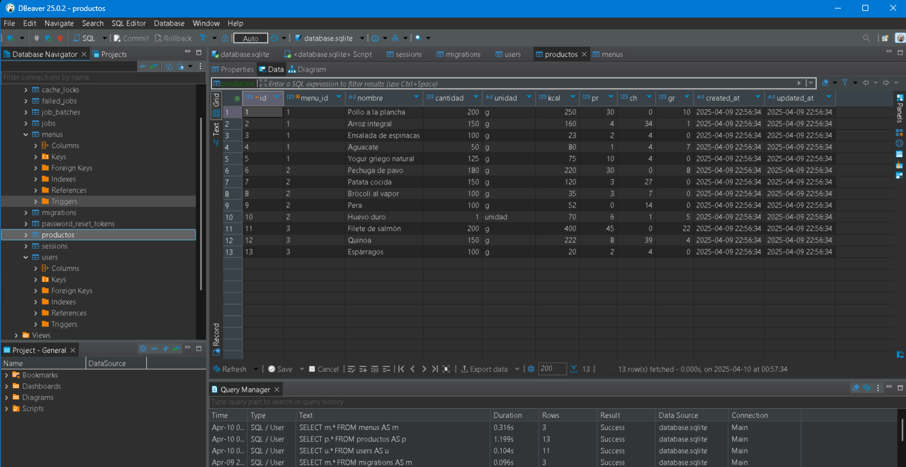
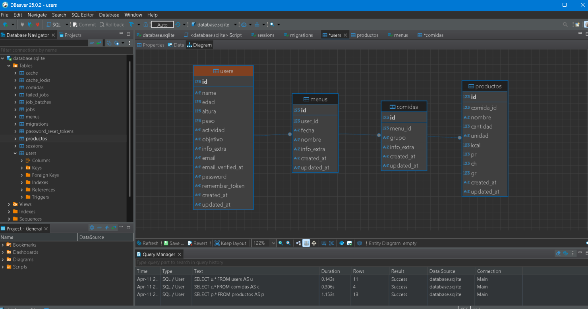
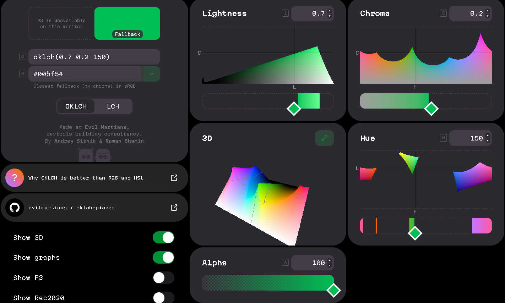

# NUTRIBOX - Alimentación Inteligente
- PROYECTO FIN DE GRADO - Jose Antonio Martínez Pastor
- SPA para la Generación de Dietas Personalizadas


# STACK DE DESARROLLO
- Framework: Laravel 12.3.0
- Frontend: React 19.0.0 (Typescript 5.8.3)
- Backend: PHP 8.2.12
- Base de datos: SQLite 3.42.0
- Router / Navegación: Inertia.js v2.0.1 (Laravel + React)
- Estilos: Tailwind CSS 4.0.6
- Empaquetador: Vite 6.0
- Control de versiones: GIT + GitHub https://github.com/salamalicun/nutribox
- node.js: v22.9.0
- npm: 11.0.0

- Gestión de tareas: Trello https://trello.com/b/7zppc0Na/%F0%9F%A5%95%F0%9F%A5%97-nutriboxes
  - Link de colaboración: https://trello.com/invite/67fa1d40e1e950f46ccb44b6/ATTI8810e61a1882ceb5582740a87b816cf5E4185F15


# ROUTER / NAVEGACIÓN
- https://inertiajs.com/
- Inertia es una capa que unirá mediante un adaptador nuestro Cliente/Frontend (React-TS) al Servidor/Backend Laravel (PHP) mediante otro adaptador, permitiéndonos construir una Single Page App (SPA) sin usar una API tradicional, se integrará todo en un mismo proyecto, back en PHP y front en React-TS (Arquitectura monolítica). Inertia.js se encargará de renderizar páginas (en el front), compartir props, enrutar, complementar la autenticación, etc..


# BASE DE DATOS
- Dada la reducida dimensión del proyecto y el no haber trabajado con SQLite anteriormente, lo he escogido como tipo de SGBD Relacional para explorar una nueva herramienta, además es ligero y almacena toda la Base de datos localmente en un único fichero lo que simplificará el desarrollo. La seguridad de acceso depende de quién tiene acceso a dicho archivo (database.sqlite) y no de usuarios dentro de la base de datos.
1. En el fichero .ENV ---> DB_CONNECTION=sqlite
2. Gestionada con: https://dbeaver.io/ (Free Universal Database Tool)

- ---> ORDEN DE CREACIÓN
  - Modelo -> Migración (User/Menu/Comida/Producto) -> Factoría -> Seeder (Dentro de DatabaseSeeder UserSeeder/MenuSeeder/ComidaSeeder/ProductoSeeder)

- ---> USUARIO DE PRUEBA (En UserSeeder.php)
  - (De la tabla 'Users', no del SGBD)
  - Nombre: Usuario Demo
  - Email: correo@ejemplo.es
  - Contraseña: Contraseña

- ---> User
  1. Modificado Modelo, Factoria, Migraciones y Seeder para añadir más campos
  2. Y el RegisteredUserController.php donde está la validación del modelo y la posterior instanciación del mismo a la hora del registro de un nuevo usuario
  3. Relaciones del modelo: 1:N con Menu
   
  - php artisan make:seeder UserSeeder
  - (Añado 10 usuarios mediante una factoria previamente configurada con Faker() y luego un usuario más manualmente)

- ---> Menu
  - php artisan make:model Menu -m (-m para crear también la migración)
  1. Modelo: Señalamos en el array "protected $fillable=[]" los campos que se podrán editar de la tabla
  2. Relaciones del modelo: 1:N con User, 1:N con Comida
  3. Migraciones: Configuramos que nombre tendrá la tabla, y que tipo, nombre y restricciones los campos, todo esto a la hora de lanzar la migración
     
  - php artisan make:seeder MenuSeeder
  - (Y añado varios menús de prueba)

- ---> Comida
  - php artisan make:model Comida -m (-m para crear también la migración)
  1. Modelo: Señalamos en el array "protected $fillable=[]" los campos que se podrán editar de la tabla, y además en este modelo añadimos una serie de funciones para calcular totales en base a las características de los productos que contenga cada comida
   
   

  2. Relaciones del modelo: 1:N con Menu, 1:N con Producto  
  3. Migraciones: Configuramos que nombre tendrá la tabla, y que tipo, nombre y restricciones los campos, todo esto a la hora de lanzar la migración

  - php artisan make:seeder ComidaSeeder
  - (Y añado varios comidas de prueba)

- ---> Modelo Producto
  - php artisan make:model Producto -m (-m para crear también la migración)
  1. Modelo: Señalamos en el array "protected $fillable=[]" los campos que se podrán editar de la tabla
  2. Relaciones del modelo: 1:N con Comida
  3. Migraciones: Configuramos que nombre tendrá la tabla, y que tipo, nombre y restricciones los campos, todo esto a la hora de lanzar la migración
   
  - php artisan make:seeder ProductoSeeder
  (Y añado varios productos de prueba)


---> MIGRACIÓN, AGRUPACIÓN SEEDERS Y SIEMBRA
  1. php artisan migrate:fresh
  2. Crear en el orden correcto ---> DatabaseSeeder.php
    
    ```public function run(): void
     {
            $this->call([
              UserSeeder::class,
              MenuSeeder::class,
              ComidaSeeder::class,
              ProductoSeeder::class,
          ]);
     }```
  
  3. php artisan db:seed
   




# API's
- OPEN FOOD FACTS
    - https://es.openfoodfacts.org/data
    - https://github.com/openfoodfacts/openfoodfacts-laravel

- DEEPSEEK
  - DEEPSEEK_API_KEY="sk-ed3ad3e46b7447c1a9a8a21f560cec25"
  - https://api-docs.deepseek.com/

  - ---> Cliente DEEPSEEK para PHP
    - https://github.com/deepseek-php/deepseek-php-client
    - composer require deepseek-php/deepseek-php-client

- PEXELS
  - PEXELS_API_KEY="cvWiNcTFlkptWql4azsVgWh2qe7zC6Wj5xrqCVRPrbsDAohnwXmRnPGr"
  - https://www.pexels.com/api/documentation/


# TAILWIND CSS v4
Utilizaremos el Framework de CSS en su versión 4 pudiendo disponer de sus clases de utilidad predefinidads y características responsive, por ejemplo:
- opacity-100 transition-opacity duration-750 ---> transiciones
- dark:bg-[#3E3E3A] ---> if(Apariencia oscura){color fondo gris oscuro}
- lg:mb-6 ---> if(tamaño pantalla grande){margin bottom 24px}

---> CONFIGURACIÓN POR DEFECTO
  - tailwind.config.js
  - Aquí se definimos los colores y fuentes personalizadas para nuestro proyecto

---> VALORES OKLCH
  - Los valores por defecto vienen con el sistema OKLCH, donde por ejemplo nuestro color de acento (Verde) será el siguiente:
  - --accent: oklch(0.7 0.2 150);
  -  0.7 ---> Luminosidad (1 = blanco, 0 = negro)
  -  0.2 ---> Croma (Saturación)
  -  150 ---> Tono (150° = verde en OKLCH)

    Verde normal:
    https://oklch.com/#0.723,0.219,149.58,100

    :dark
    https://oklch.com/#0.7,0.2,150,100
    



# LIBRERIA DE COMPONENTES REACT-TS: shadcn/ui
- Biblioteca open source de componentes recomendada para Laravel 12 + React
- https://ui.shadcn.com/


# LIBRERIA DE COMPONENTES REACT-TS: Reactbits
- Biblioteca de componentes React
1. Para que no de errores al trabajar con React19 (ya que todas las librerias NO se han actualizado a esa versión ni han actualizado todas sus dependencias, así evitamos conflictos) utilizamos el flag "--legacy-peer-deps"
   - npm i framer-motion --legacy-peer-deps
   - npm i @react-spring/web --legacy-peer-deps
   - npm update --legacy-peer-deps

2. Repositorio jsrepo (TS + Tailwind)
   - npx jsrepo init https://reactbits.dev/ts/tailwind

3. Dependencia solo para el componente Grid-Motion
   - npm i gsap


# DESPLIEGUE EN SERVIDOR VPS
1. Hostinger
2. Servidor VPS
3. Apache
   
- Comandos

- Comprobación base de datos:
- sqlite3 database/database.sqlite
- .tables
- SELECT * FROM users;


https://www.flaticon.com/free-icon/noodle_6305595
https://www.flaticon.com/free-icon/salad_1880223